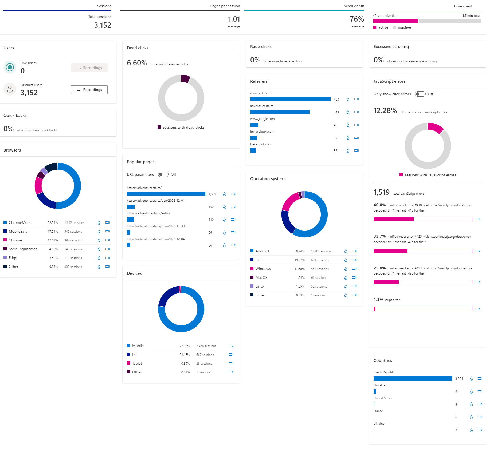
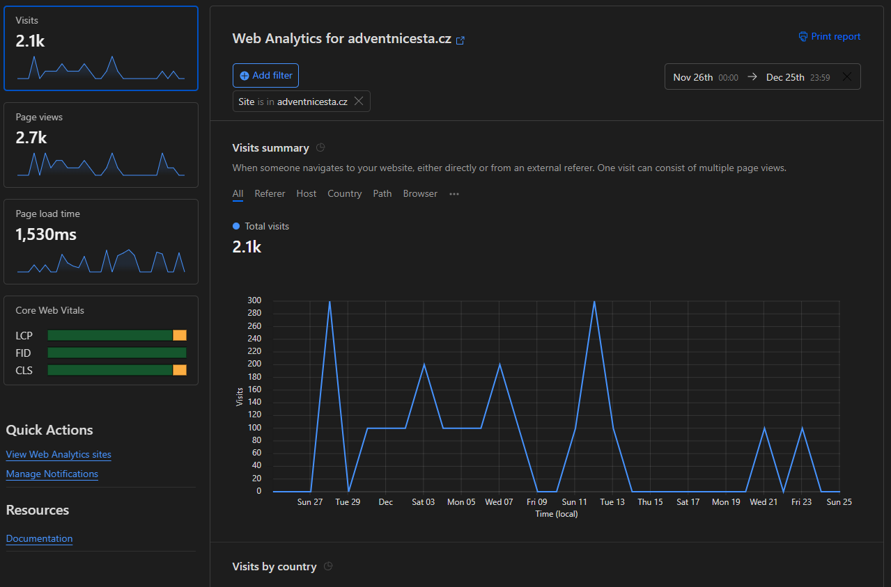
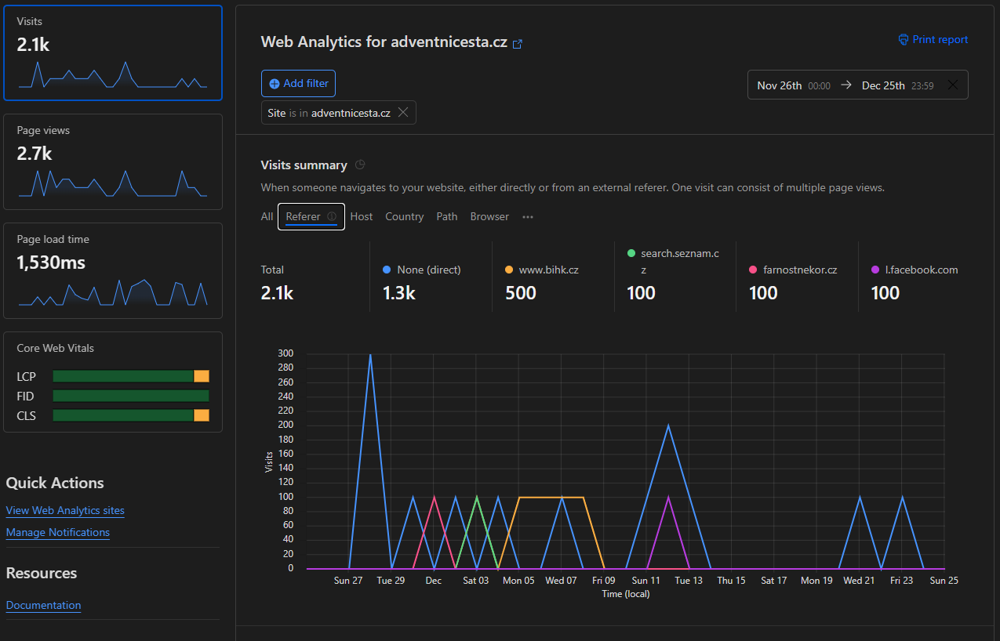
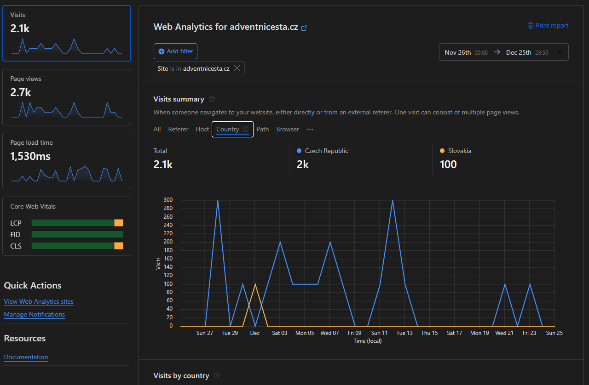
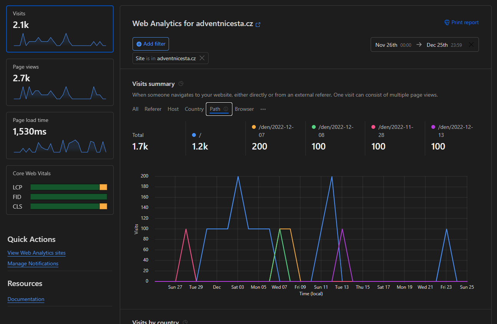
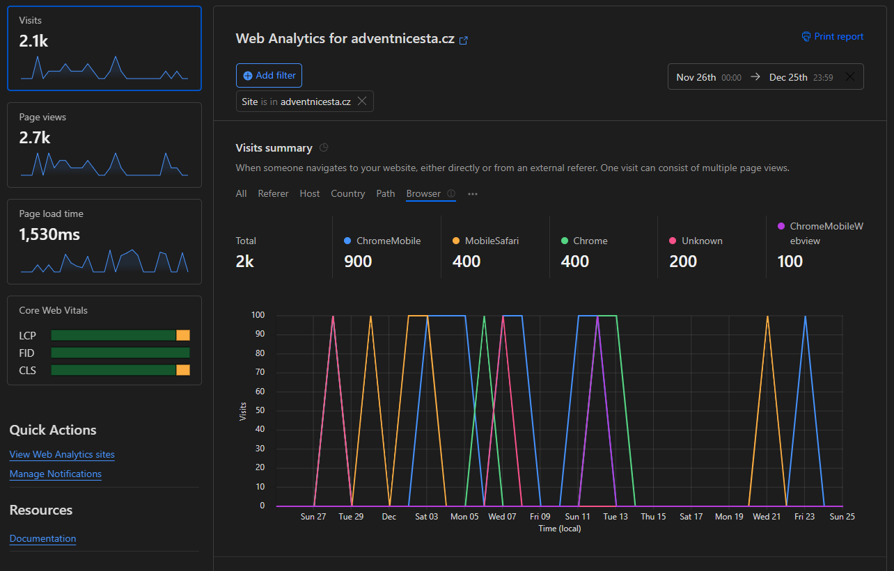
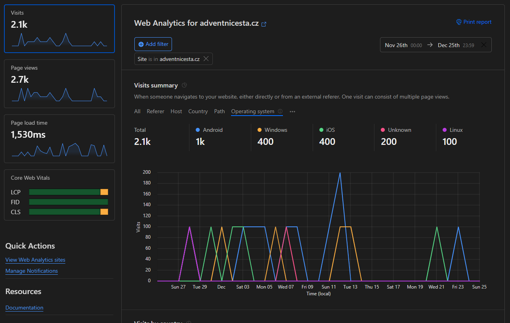
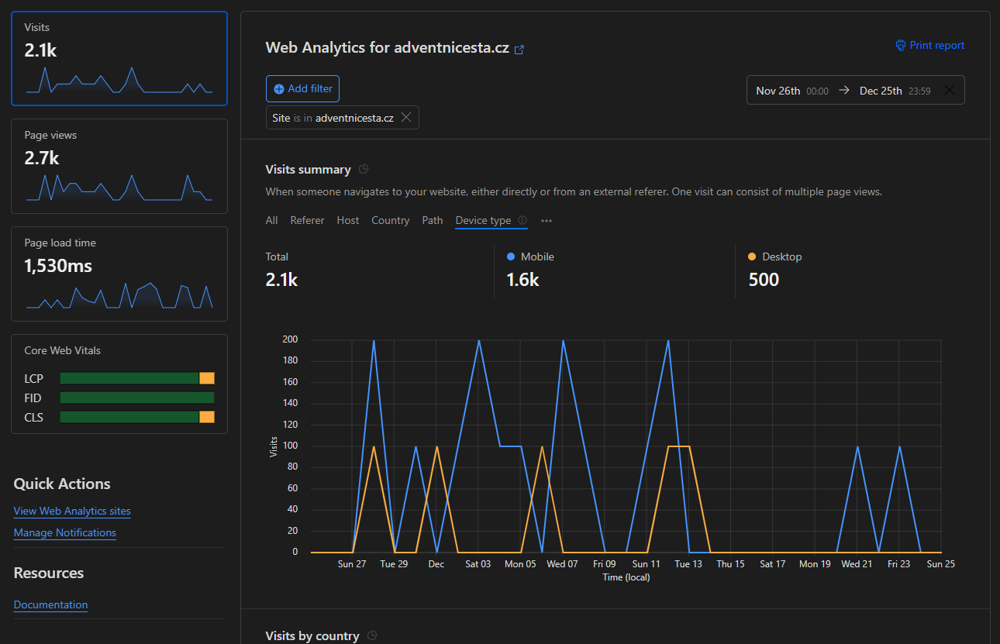

# Zpětná vazba k adventu 2022

## Obecně

- Notifikace přivedou prvidelně více lidí. Na druhou stranu je aplikace výborně použitelná i bez nich.
- Při větší propagaci, by se aplikace určitě více používala. Většina lidí o ni vůbec nevěděla a když v průběhu adventu zjistili, co vše nabízí, začali používat a říkali, že je mrzí, že o ní nevěděli dříve. (viz osobní rozhovory a diskuze s Dejvem Špeldou)
- Pokud by se aplikace vypublikovala dříve, byla by lépe idenxovatelná. Tedy by ji šlo najít v google dříve než v polovině adventu. Také by ji šlo exportovat a přidat do Apple Store a Google Play.

## Dotazník

### Interpretace výsledků

Lidé používali aplikaci na mobilu. Úvodní obrazovak i text jsou přehledné. Poslouchali audionahrávky. V nahrávkách by bylo dobré zlepšit syntetizaci slov jako Jesus atd.

Uživatelé by takovýchto zamyšlení uvítali rádi více.

### Popis vzorku

Na dotazník neodpovědělo veliké množství lidí. To bylo pravděpodobně způsobeno tím, že aplikace nebylo nijako hodně čtená a především tím, že tlačítko bylo v spodní části stránky.

## Microsoft Clarity

*Hodnoty jsou v časovém rozmezí: 11/26/2022 - 12/26/2022.*

## Cloudflare

Na aplikaci nebyl proveden žádný útok, který by byl zachycen Cloudflarem.

## Google Search Console

Web dělán na posledni chvíli a proto špatně indexován. Více viz složka `search-console`.
